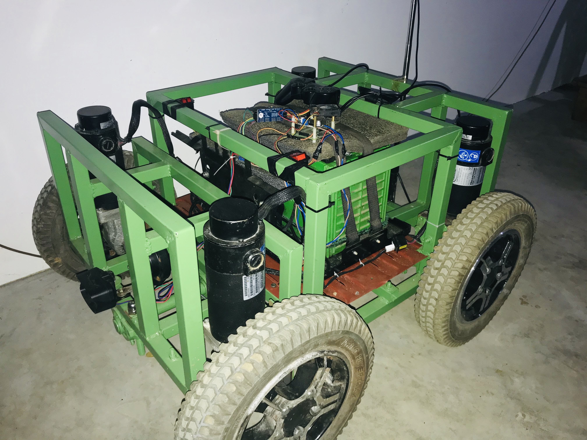

# scooby

Welcome! This is an open source self-driving development platform aimed for rapid prototyping, deep learning, and robotics research. The system currently runs on a modified electric golf cart. Here are our goals:

### Goals:
Research and develop a deep learning-driven self-driving car. The vehicle should be able to achieve level 4 autonomy within a geofenced area.

#### The modules in this project.

1. End-to-End Steering (Behavioral cloning)
2. Semantic Segmentation
3. Object Detection 🚙
4. Drive by Wire (DBW)
5. CARLA simulator integration 
6. ZED stereoscopic vision system
7. Mapping with rtabamp
8. Path planning with ROS nav stack. 
9. Localization, pose tracking, and odom with ZED and rtabmap.
